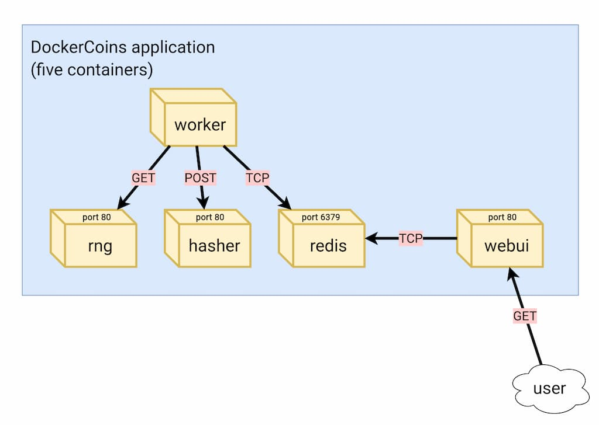
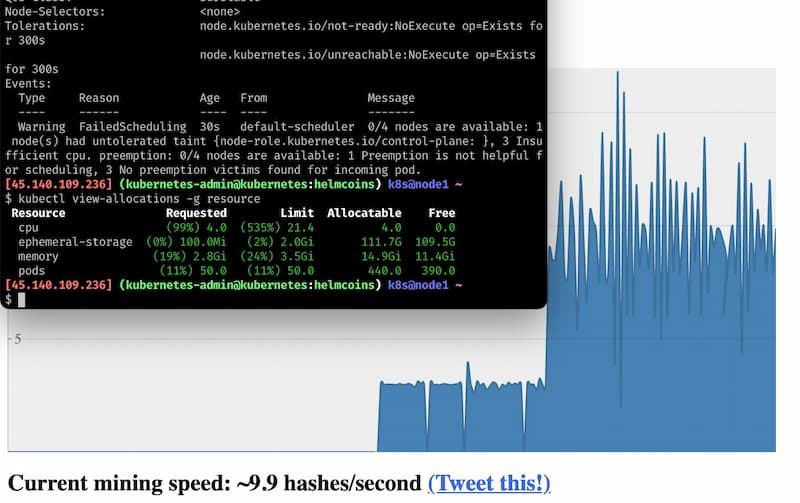

# HelmCoins
It is an umbrella Helm chart for the famous DockerCoin microservices miner! 💰🐳📦🚢

## Architecture
DockerCoins is made of 5 services:
* rng = web service generating random bytes
* hasher = web service computing hash of POSTed data
* worker = background process calling rng and hasher
* webui = web interface to watch progress
* redis = data store (holds a counter updated by worker)

<p align="center">

</p>

Figure 1 : Diagram showing the 5 containers of the applications

### Application running

<p align="center">

</p>

Figure 2 : Web interface showing the scaling-up of the worker deployment

### How DockerCoins works
* generate a few random bytes
* hash these bytes
* increment a counter (to keep track of speed)
* repeat forever!

Reminder: [DockerCoins](https://containers.goffinet.org/shared/sampleapp) is not a cryptocurrency. No, you can't buy coffee with DockerCoins ;)
(the only common points are "randomness", "hashing", and "coins" in the name)

## Features
- **Helm Chart Deployment**: Easily deploy the HelmCoins application using Helm charts.
- **Cryptocurrency Management**: Track and manage your cryptocurrency assets.
- **Analysis Tools**: Perform various analyses on your cryptocurrency portfolio.
- **Scalability**: Designed to handle large datasets and scale with your needs.

## Prerequisites
- [Kubernetes](https://kubernetes.io/docs/setup/) Cluster with a [CNI](https://kubevious.io/blog/post/comparing-kubernetes-container-network-interface-cni-providers) and a [Container Runtime](https://www.cloudraft.io/blog/container-runtimes), OCI-compatible (like Docker/containerd) if it's locally, you can [choose between]((https://thechief.io/c/editorial/k3d-vs-k3s-vs-kind-vs-microk8s-vs-minikube/)):
    - [k3s](https://github.com/k3s-io/k3s)
    - [k3d the CNCF's k3s in Docker](https://github.com/k3d-io/k3d)
    - [kind](https://github.com/kubernetes-sigs/kind)
    - [microk8s](https://github.com/canonical/microk8s)
    - [minikube](https://github.com/kubernetes/minikube)
    - [Docker Desktop](https://www.docker.com/products/docker-desktop/)
    - [kelseyhightower/kubernetes-the-hard-way](https://github.com/kelseyhightower/kubernetes-the-hard-way) and if you want to learn more: [Denis GERMAIN's talk](https://www.youtube.com/watch?v=OCMNA0dSAzc)
    - etc...
- [Helm](https://helm.sh/docs/intro/quickstart/) 3.x

## Installation
1. Clone the repository:
    ```sh
    git clone https://github.com/davidaparicio/helmcoins.git
    cd helmcoins
    ```

2. Deploy with Helm:
    ```sh
    ./deploy.sh
    ```

## Usage

### Managing Crypto Mining Farm
You can add, remove cryptocurrency workers using the HelmCoins Kubernetes deployment.

### Analysis Tools
HelmCoins provides various analytical tools to help you make informed decisions about your cryptocurrency investments. Access these tools from the main dashboard after deployment, a.k.a the HTTP WebUI service.

## Contributing
Contributions are welcome! Please fork the repository and submit a pull request.

## Original project
Fork of the opensource project of [Jérôme Petazzoni](https://github.com/jpetazzo/)'s [orchestration workshop](https://github.com/jpetazzo/container.training), available on GitHub at [https://github.com/dockersamples/dockercoins](https://github.com/dockersamples/dockercoins).

## License
Licensed under the MIT License, Version 2.0 (the "License"). You may not use this file except in compliance with the License.
You may obtain a copy of the License [here](https://choosealicense.com/licenses/mit/).

If needed some help,  there are a ["Licenses 101" by FOSSA](https://fossa.com/blog/open-source-licenses-101-mit-license/), a [Snyk explanation](https://snyk.io/learn/what-is-mit-license/)
of MIT license and a [French conference talk](https://www.youtube.com/watch?v=8WwTe0vLhgc) by [Jean-Michael Legait](https://twitter.com/jmlegait) about licenses.

## Contact
For any questions or issues, please open an issue on the [Github repository](https://github.com/davidaparicio/helmcoins/issues).